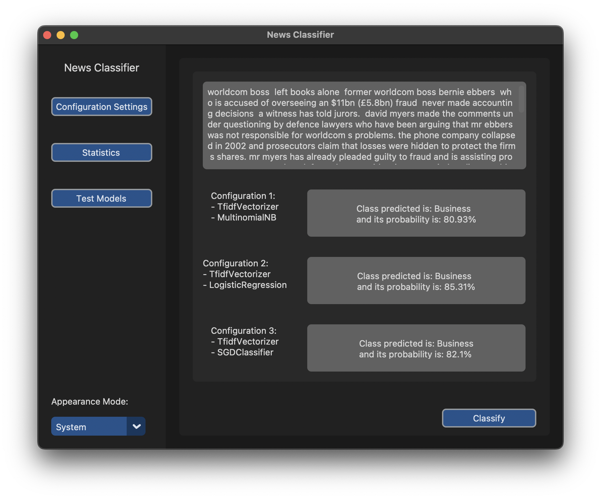

# News Classifier

News Classifier is a python application that exploit text mining to categorize news with the right topic 
(for example the topics with the default dataset are: world, business, sport and sci/tech).

Another important thing is that the application can work with different dataset, but they must have 
the same structure that is: one column for text in input and another one for the true class.
So the application isn't addicted to the dataset given in input, but to guarantee its correct behavior is 
necessary set up some settings when the user change the dataset.

## Text Classification

The process to classify the text has composed by three steps:
1. Preprocess
   * Text preprocess is a very important phase, that include:
     * Expanding contraction (only for english language)
     * Removal of stopwords, punctuation, html tags, urls, diacritics, digits and extra whitespaces
     * Stemming
     * Lemmatization
2. <a href="https://scikit-learn.org/stable/modules/generated/sklearn.feature_extraction.text.TfidfVectorizer.html">TfidfVectorizer</a>
3. Classifiers:
   - <a href="https://scikit-learn.org/stable/modules/generated/sklearn.naive_bayes.MultinomialNB.html">MultinomialNB</a>
   - <a href="https://scikit-learn.org/stable/modules/generated/sklearn.linear_model.LogisticRegression.html">LogisticRegression</a>
   - <a href="https://scikit-learn.org/stable/modules/generated/sklearn.linear_model.SGDClassifier.html">SGDClassifier</a>
   * To find the best parameters of classifiers is used <a href="https://scikit-learn.org/stable/modules/generated/sklearn.model_selection.GridSearchCV.html">GridSearchCV</a>
   * Model of classifiers are saved in [models_saved folder](models_saved), so every time that application restarts doesn't refit models but 
   loads them from the folder. Otherwise, application fits and save models when the dataset changes. 

## Data

Two different datasets is used to test the correct behavior of the application:
- <a href="https://www.kaggle.com/datasets/amananandrai/ag-news-classification-dataset">AG News</a> (default configuration)
- <a href="https://www.kaggle.com/datasets/yufengdev/bbc-fulltext-and-category">BBC News</a>

## Models Evaluations

#### AGNews
* Accuracy:
  - MultinomialNB = 0.90
  - LogisticRegression = 0.91
  - SGDClassifier = 0.91

#### BBC News
* Accuracy:
  - MultinomialNB = 0.97
  - LogisticRegression = 0.98
  - SGDClassifier = 0.98

## Dependencies

News Classifier needs the following libraries:
- <a href="https://libraries.io/pypi/contractions/0.1.73">Contractions</a>
- <a href="https://libraries.io/pypi/customtkinter/5.0.3">Customtkinter</a>
- <a href="https://pypi.org/project/dill/">Dill</a>
- <a href="https://matplotlib.org">Matplotlib</a>
- <a href="https://www.nltk.org">NLTK</a>
- <a href="https://numpy.org/">NumPy</a>
- <a href="https://pandas.pydata.org/">Pandas</a>
- <a href="https://pypi.org/project/pycountry/">Pycountry</a>
- <a href="https://scikit-learn.org/stable/">SKLearn</a>
- <a href="https://seaborn.pydata.org">Seaborn</a>
- <a href="https://pypi.org/project/simplemma/">Simplemma</a>
- <a href="https://texthero.org">Texthero</a>
- <a href="https://tqdm.github.io">Tqdm</a>
- <a href="https://www.scikit-yb.org/en/latest/">Yellowbrick</a>

[Here](requirements.txt) is present the file with all dependencies of the project.

To install all dependencies use:  `pip install -r requirements.txt`

## Usage

In [the src folder](src) of this repo, there is code of the application to run locally on your own computer.
In your terminal while in this repo directory, run the following commands to use application:

>`cd src` 
> 
> `python main.py`

or
> `python src/main.py`

In [the file main](/src/main.py) is possible to set which classifiers you want use.

This application has these following buttons:
* Classify
  * Calculates predicted class and its probability of the news written in textbox for each classifier.
* Configuration Settings
  * Allows to change dataset setting up some setting (for example the names of the columns relative to text to classify and to true label)
* Statistics
  * Displays statistics on:
    * Dataset:
      * Class Distribution
      * Wordcloud of training and test set
      * Most frequent words on training and test set
      * General Information on dataset
    * Classifiers (They are for each one):
      * Metrics
      * Confusion Matrix
      * Area Under the Curve
      * Class Prediction Error
* Test Models
  * Tests fitted models on a different dataset

The image below is the home of application:

